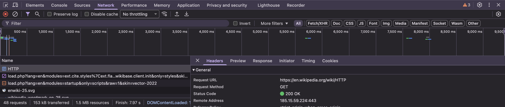
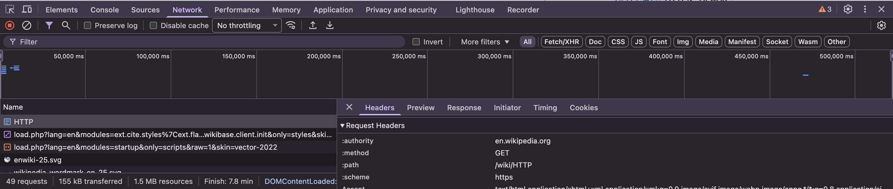
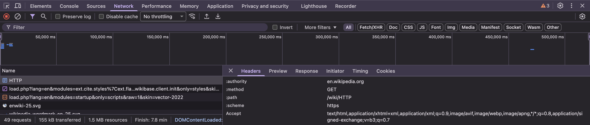
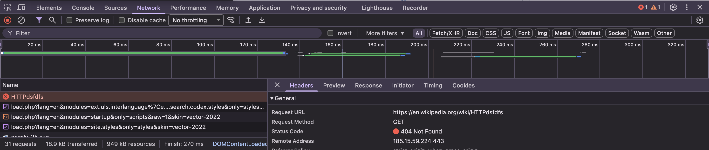
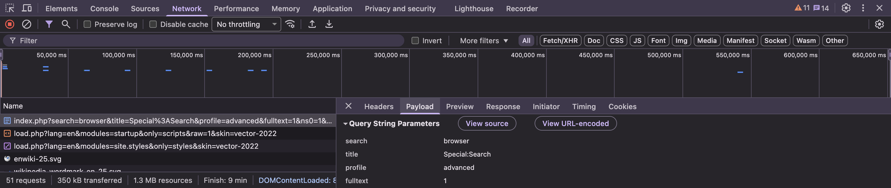

# Отчет по Лабораторной работе №1: HTTP

## Инструкции по запуску проекта

Так как данная лабораторная работа является аналитической и не требует компиляции кода, «запуск» подразумевает воспроизведение процесса анализа сетевого трафика.

1.  **Необходимое ПО:** Веб-браузер (Google Chrome, Firefox, Edge или Safari).
2.  **Запуск инструментов разработчика:**
    - Откройте браузер.
    - Нажмите клавишу `F12` или сочетание `Cmd+Option+I`.
    - Перейдите во вкладку **Network** (Сеть).
3.  **Выполнение анализа:** Следуйте шагам, описанным в разделе "Примеры использования", обновляя страницы и фильтруя запросы.

---

## Описание лабораторной работы

Целью данной работы является изучение протокола HTTP (HyperText Transfer Protocol) на практике. Работа включает в себя:

- Анализ реальных HTTP-запросов и ответов с использованием инструментов разработчика браузера (DevTools).
- Изучение структуры URL, методов запросов, кодов состояния и заголовков.
- Сравнение успешных запросов и запросов к несуществующим ресурсам.
- Ручное составление HTTP-запросов (GET, POST, PUT) для взаимодействия с условным API.

---

## Краткая документация к проекту

Проект представляет собой отчет о взаимодействии клиента (браузера) и различных серверов (Wikipedia, GitHub, Sandbox).

- **Инструментарий:** Chrome DevTools.
- **Исследуемые объекты:**
  - `GET` запросы для получения HTML-страниц.
  - Query Parameters (параметры строки запроса) при поиске.
  - Коды состояния: `200 OK`, `404 Not Found`.
  - Специфические методы: `POST`, `PUT`, `PATCH`.

---

## Примеры использования и Ход работы

### Задание 1. Анализ HTTP-запросов (Wikipedia)

#### 1.1 Успешный запрос (Главная страница)

**Действие:** Переход на `https://en.wikipedia.org/wiki/HTTP`.

**Анализ первого запроса (HTTP):**

- **URL:** `https://en.wikipedia.org/wiki/HTTP`
- **Метод:** `GET`. Используется, так как мы хотим **получить** представление ресурса, не изменяя его.
- **Статус ответа:** `200 OK`. Запрос выполнен успешно, ресурс найден и передан клиенту.
- **Заголовки (Основные):**
  - _Response Headers:_
    - `Content-Type`: `text/html; charset=UTF-8` (сервер вернул HTML).
    - `Date`: Время ответа сервера.
  - _Request Headers:_
    - `User-Agent`: Информация о браузере и ОС.
    - `Accept`: `text/html,...` (браузер ожидает HTML документ).
- **Тело ответа:** HTML-код страницы (структура документа, тексты, ссылки).

**Дополнительные запросы:**
При загрузке страницы было отправлено множество дополнительных запросов (CSS стили, JavaScript файлы, изображения, шрифты). Это необходимо для корректного отображения (рендеринга) страницы и её интерактивности, так как основной HTML-файл содержит ссылки на эти ресурсы.






#### 1.2 Неудачный запрос (404)

**Действие:** Переход на `https://en.wikipedia.org/wiki/HTTPdsfdfs`.

**Анализ:**

- **URL:** `https://en.wikipedia.org/wiki/HTTPdsfdfs`
- **Статус ответа:** `404 Not Found`.
- **Причина:** Сервер не нашел ресурса, соответствующего данному URL (статья с таким названием не существует).



---

### Задание 2. Анализ HTTP-запросов. Часть 2

**Действие:** Выполнен поиск по слову "browser" через расширенную форму поиска.

**Анализ запроса:**

- **URL запроса:** `https://en.wikipedia.org/w/index.php?search=browser&title=Special%3ASearch&profile=advanced&fulltext=1&ns0=1`
- **Метод запроса:** `GET`.
  - **Почему:** Поиск — это идемпотентная операция (не изменяет состояние сервера), целью которой является получение данных. Метод `GET` позволяет передавать параметры поиска прямо в URL, что делает ссылку сохраняемой (можно добавить в закладки) и передаваемой другим пользователям. Кэширование ответов также возможно именно при использовании `GET`.

- **Query Parameters (Параметры строки запроса):**
  Строка запроса начинается после знака `?` и параметры разделены знаком `&`.
  1.  **`search=browser`**:
      - **Значение:** `browser`.
      - **Описание:** Ключевое слово или фраза, которую ввел пользователь. Это основной payload запроса.
  2.  **`title=Special:Search`** (в URL закодировано как `Special%3ASearch`):
      - **Значение:** `Special:Search`.
      - **Описание:** Указывает движку MediaWiki, какую именно страницу или контроллер нужно загрузить. В данном случае это служебная страница поиска.
  3.  **`profile=advanced`**:
      - **Значение:** `advanced`.
      - **Описание:** Указывает на использование расширенного профиля поиска (например, поиск не только по заголовкам, но и по другим критериям, настроенным пользователем).
  4.  **`fulltext=1`**:
      - **Значение:** `1` (True).
      - **Описание:** Флаг, который принудительно включает полнотекстовый поиск по содержимому страниц, а не попытку быстрого перехода (Go) на страницу с точным совпадением названия.
  5.  **`ns0=1`**:
      - **Значение:** `1` (True).
      - **Описание:** Фильтр пространства имен (Namespace). `ns0` соответствует основному пространству статей (Articles). Если бы мы искали в обсуждениях или справке, параметры были бы другими (например, `ns1`, `ns12`).



---

### Задание 3. Анализ стороннего сайта (GitHub)

**Действие:** Переход на `https://github.com`.

**Анализ:**

- **URL:** `https://github.com/`
- **Метод:** `GET`
- **Статус:** `200 OK`
- **Заголовки:**
  - `Server`: `GitHub.com`
  - `Content-Encoding`: `gzip` (контент сжат для ускорения загрузки).
  - `Strict-Transport-Security`: Принуждает использовать HTTPS.

---

### Задание 4. Составление HTTP-запросов

#### 4.1 GET-запрос

**Запрос:**

```http
GET / HTTP/1.1
Host: sandbox.usm.com
User-Agent: Artiom Zui
```

**Вопрос: Что такое User-Agent и для чего он используется?**
**Ответ:** `User-Agent` — это заголовок HTTP-запроса, который идентифицирует клиентское приложение (браузер, бот, скрипт), операционную систему и их версии. Сервер использует его для:

1.  Адаптации контента (например, мобильная версия сайта для телефона).
2.  Сбора статистики.
3.  Блокировки нежелательных ботов.

#### 4.2 POST-запрос

**Запрос:**

```http
POST /cars HTTP/1.1
Host: sandbox.usm.com
Content-Type: application/x-www-form-urlencoded

make=BMW&model=Series7&year=2022
```

_(Примечание: Если параметры передаются как JSON, Content-Type будет `application/json`, а тело `{ "make": "Toyota"... }`)._

**Вопрос: Какие еще методы HTTP-запросов существуют и для чего они используются?**
**Ответ:**

- `HEAD`: Аналогичен GET, но возвращает только заголовки (без тела). Используется для проверки существования ресурса.
- `PUT`: Полная замена ресурса по указанному URL.
- `PATCH`: Частичное изменение ресурса.
- `DELETE`: Удаление ресурса.
- `OPTIONS`: Запрос поддерживаемых сервером методов для данного URL (CORS).
- `CONNECT`: Преобразование соединения в туннель (обычно для HTTPS через прокси).
- `TRACE`: Эхо-тест, возвращает полученный запрос (для отладки).

#### 4.3 PUT-запрос

**Запрос:**

```http
PUT /cars/1 HTTP/1.1
Host: sandbox.usm.com
User-Agent: Artiom Zui
Content-Type: application/json

{
 "make": "BMW",
 "model": "Series3",
 "year": 2022
}
```

**Вопрос: В чем разница между PATCH и PUT запросами?**
**Ответ:**

- **PUT (Idempotent):** Подразумевает **полную** замену ресурса. Если вы передадите только поле `year`, остальные поля (`make`, `model`) могут быть стерты или сброшены в null (зависит от реализации, но по стандарту это полная замена).
- **PATCH (Not Idempotent):** Подразумевает **частичное** обновление. Вы передаете только те поля, которые нужно изменить.

#### 4.4 Анализ серверного ответа

**Исходный запрос пользователя:**

```http
POST /cars HTTP/1.1
Host: sandbox.com
Content-Type: application/json
User-Agent: John Doe

model=Corolla&make=Toyota&year=2020
```

**Возможный ответ сервера:**
_(Примечание: В запросе есть ошибка. Заголовок говорит `application/json`, а тело отформатировано как `x-www-form-urlencoded`. Хороший сервер вернет 400 Bad Request. Но если предположить, что сервер "умный" или это условность задачи, приведем успешный ответ)._

```http
HTTP/1.1 201 Created
Date: Sun, 15 Feb 2026 12:00:00 GMT
Content-Type: application/json
Content-Length: 65
Location: http://sandbox.com/cars/123

{
  "id": 123,
  "status": "success",
  "message": "Car created successfully"
}
```

**Ситуации для кодов состояния (на примере данного запроса):**

- **200 OK:** Запрос выполнен успешно, но новый ресурс не был создан (редко для POST создания), либо сервер вернул результат действия.
- **201 Created:** Ресурс (машина) успешно создан в базе данных. Стандартный ответ для успешного `POST`.
- **400 Bad Request:** Ошибка валидации данных (например, год выпуска 1800 или отрицательный) или **несоответствие заголовка Content-Type телу запроса** (JSON vs Form Data).
- **401 Unauthorized:** Пользователь не авторизован (не передан токен или логин/пароль).
- **403 Forbidden:** Пользователь авторизован, но у него нет прав на добавление автомобилей (например, он обычный юзер, а не админ).
- **404 Not Found:** URL `/cars` не существует на сервере (ошибка в адресе API).
- **500 Internal Server Error:** На сервере произошла необработанная ошибка (упала база данных, ошибка в коде PHP/Python/Java при обработке).
