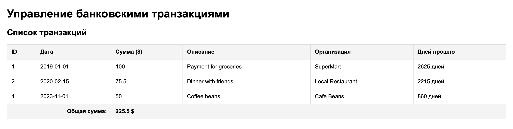

# Лабораторная работа №4. Массивы и Функции

## 1. Работа с массивами и функциями (Банковские транзакции)

```php
<?php
declare(strict_types=1);

// Инициализация массива транзакций
$transactions = [
    [
        "id" => 1,
        "date" => "2019-01-01",
        "amount" => 100.00,
        "description" => "Payment for groceries",
        "merchant" => "SuperMart",
    ],
    [
        "id" => 2,
        "date" => "2020-02-15",
        "amount" => 75.50,
        "description" => "Dinner with friends",
        "merchant" => "Local Restaurant",
    ]
];

// Функция для расчета общей суммы
function calculateTotalAmount(array $transactions): float {
    $total = 0.0;
    foreach ($transactions as $transaction) {
        $total += $transaction['amount'];
    }
    return $total;
}

// Функция поиска по описанию
function findTransactionByDescription(string $descriptionPart): array {
    global $transactions;
    return array_filter($transactions, function($transaction) use ($descriptionPart) {
        return str_contains(strtolower($transaction['description']), strtolower($descriptionPart));
    });
}

// Функция поиска по ID
function findTransactionByIdFilter(int $id): ?array {
    global $transactions;
    $result = array_filter($transactions, function($transaction) use ($id) {
        return $transaction['id'] === $id;
    });
    return !empty($result) ? array_values($result)[0] : null;
}

// Функция расчета дней с момента транзакции
function daysSinceTransaction(string $date): int {
    $transactionDate = new DateTime($date);
    $currentDate = new DateTime();
    return (int)$currentDate->diff($transactionDate)->days;
}

// Функция добавления новой транзакции
function addTransaction(int $id, string $date, float $amount, string $description, string $merchant): void {
    global $transactions;
    $transactions[] = [
        "id" => $id,
        "date" => $date,
        "amount" => $amount,
        "description" => $description,
        "merchant" => $merchant,
    ];
}

// Тестирование добавления и сортировки
addTransaction(3, "2023-11-01", 50.00, "Coffee beans", "Cafe Beans");

$transactionsByDate = $transactions;
usort($transactionsByDate, function($a, $b) {
    return strtotime($a['date']) <=> strtotime($b['date']);
});
?>
```



## 2. Работа с файловой системой (Галерея изображений)

```php
<?php
$dir = 'image/';

if (is_dir($dir)) {
    $files = scandir($dir);
    if ($files !== false) {
        for ($i = 0; $i < count($files); $i++) {
            if ($files[$i] !== "." && $files[$i] !== ".." && pathinfo($files[$i], PATHINFO_EXTENSION) === 'jpg') {
                $path = $dir . $files[$i];
                echo "";
            }
        }
    }
} else {
    echo "<p>Директория с изображениями не найдена.</p>";
}
?>
```


## 3. Контрольные вопросы

**1. Что такое массивы в PHP?**
Массив в PHP — это мощная структура данных, представляющая собой упорядоченную карту (ordered map), которая связывает определенные значения с их ключами.

Массивы могут выступать в роли:

- **Индексированных списков** (с числовыми ключами)
- **Ассоциативных массивов** (где ключами выступают строки)
- **Многомерных массивов**

**2. Каким образом можно создать массив в PHP?**
Существует два основных синтаксиса:

- **Короткий синтаксис (современный):** Использование квадратных скобок `[]`. Например: `$arr = [1, 2, 3];` или `$arr = ["key" => "value"];`.
- **Традиционный синтаксис:** Использование языковой конструкции `array()`. Например: `$arr = array(1, 2, 3);`.

**3. Для чего используется цикл `foreach`?**
Цикл `foreach` предназначен исключительно для удобного перебора массивов и объектов. В отличие от `for`, программисту не нужно знать точный размер массива или вручную управлять счетчиком. Существует два варианта его использования: для перебора только значений (`foreach ($array as $value)`) и для одновременного доступа к ключам и значениям (`foreach ($array as $key => $value)`).
